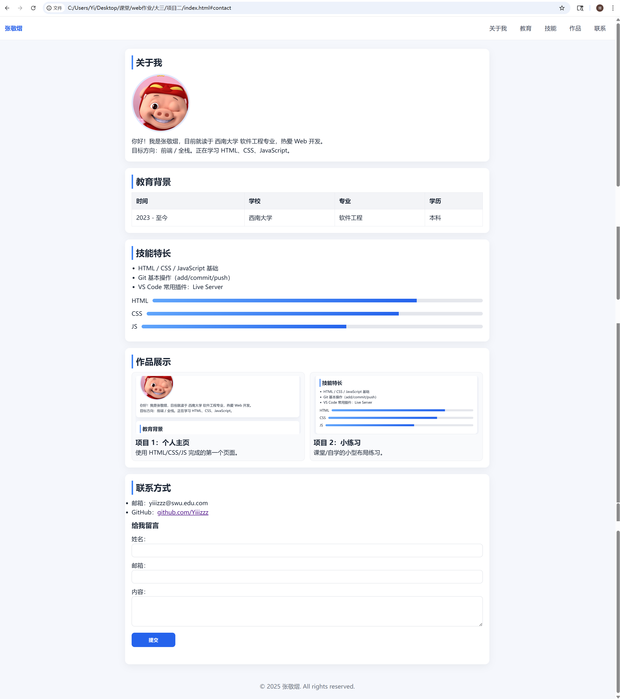

# 实践项目 2：基于 CSS 优化个人主页  实验报告
## 一、基本信息
- **姓名**：张敬熠
- **学号**：222023321062101
- **班级**：软工中外34班

---

## 二、实验目的
1. 掌握 HTML 文档结构与常用标签的使用。
2. 能够引入并使用外部 CSS 对页面进行美化与布局。
3. 理解并应用 CSS 选择器、盒模型、布局（Flex/Grid）与媒体查询。
4. 使用 CSS 实现卡片、导航、表格、按钮、过渡动画等常见样式。
5. 使用 JavaScript 完成基础交互（汉堡菜单、表单校验、滚动效果）。
6. 实现响应式页面，适配手机/平板/PC 多端显示。

---

## 三、实验环境
- **操作系统**：Windows 10
- **开发工具**：VS Code（配 Live Server 插件）
- **浏览器**：Google Chrome

---

## 四、实验内容与步骤

### 4.1 项目结构与文件
本次实验的目录结构如下：

实践项目2/
 ├─ index.html
 ├─ styles.css
 ├─ script.js
 └─ images/
 ├─ me.jpg
 ├─ project1.jpg
 └─ project2.jpg

index.html 用于编写网页结构  
styles.css 用于页面样式优化  
script.js 用于互动效果（菜单、动画、表单校验）  
images 存放头像与项目截图

---

### 2. 编写 index.html（HTML 主体结构）
有以下结构布局：

- `<header>`：顶部导航栏，包含姓名、导航链接、移动端汉堡菜单按钮  
- `<main>`：内容部分，包含  
  - 关于我（头像 + 简介）  
  - 教育背景（使用 table 展示）  
  - 技能特长（列表 + 进度条）  
  - 作品展示（两列卡片）  
  - 联系方式（邮箱、链接）＋留言表单  
- `<footer>`：页面底部版权信息  

所有结构均使用 HTML5 语义化标签，并确保标签闭合规范。

---

### 3. 编写 styles.css（CSS 优化页面）
样式文件主要包含以下内容：

#### （1）全局设置与重置  
使用 `* { margin:0; padding:0; box-sizing:border-box }` 清除默认样式。  
设置统一字体、背景色、文字颜色等，使整体美观统一。

#### （2）导航栏美化  
- 固定在顶部（position: fixed）  
- 添加阴影与 hover 效果  
- 移动端使用汉堡菜单显示导航  

#### （3）卡片布局  
每个 section 使用白色卡片 + 圆角 + 阴影效果，让内容更易读。

#### （4）表格优化  
表头灰色背景、线条分明、统一 padding，使教育背景表格更清晰。

#### （5）按钮与输入框美化  
- 输入框 focus 高亮  
- 按钮 hover 轻微变亮  
- 弹性布局保证表单整齐排布

#### （6）动画效果  
- 页面卡片进入时使用 fade-in 动画  
- 作品卡片 hover 上浮  
- 技能条进度条在进入视口时自动填充

#### （7）响应式设计（媒体查询）
使用两级断点：

@media (max-width: 768px)
@media (max-width: 480px)

移动端优化包括：

- 导航栏变为汉堡菜单  
- 作品展示区由两列变一列  
- 头像与卡片自动居中  
- 字体和边距缩小  
- 按钮变宽，提升触控体验  

---

### 4. 编写 script.js（JavaScript 交互）
本实验使用 JavaScript 完成以下交互功能：

1. **汉堡菜单展开/收起**（移动端）  
2. **滚动时导航栏出现阴影**  
3. **点击导航自动平滑跳转至对应区域**  
4. **表单验证**：检查必填项、邮箱格式  
5. **技能条动画**：使用 IntersectionObserver 使进度条随滚动填充  

---

### 5. 页面运行结果（截图展示）

#### （1）桌面端运行截图

#### （2）移动端运行截图  

---

## 实验结果与分析

### 1. 页面结构正确性分析
- HTML 语义化结构清晰，页面逻辑分区明确。  
- 标签嵌套规范，所有区域都能正常显示。  
- 导航栏跳转正常，表单能正确反馈输入状态。  
- 浏览器控制台无报错，所有资源均正确加载。

### 2. HTML 标签使用说明
主要标签及用途如下（模板要求）：  

| 标签                              | 用途             |
| --------------------------------- | ---------------- |
| `<h1>-<h3>`                       | 标题、模块名称   |
| `
`                             | 文字段落         |
| ``                           | 头像与作品截图   |
| `<a>`                             | 导航链接、超链接 |
| `<ul><li>`                        | 技能列表         |
| `<table><tr><th><td>`             | 教育背景表格     |
| `<form><input><textarea>`         | 留言表单         |
| `<header><main><section><footer>` | HTML5 语义化结构 |

---

## 遇到的问题及解决方案

### 问题 1：图片无法加载  
**原因**：文件名和 HTML 路径不一致（me.jpeg vs me.jpg）  
**解决方法**：统一所有文件名，确保存放在 images 文件夹内。

---

### 问题 2：汉堡菜单不工作  
**原因**：script.js 未正确引入或类名拼错  
**解决方法**：检查 `` 放在 `</body>` 前，同时打开 F12 控制台查看报错并修复。

---

### 问题 3：移动端布局未变化  
**原因**：媒体查询断点写错或浏览器未缩到断点尺寸  
**解决方法**：检查 `@media` 语法，并将浏览器宽度缩到 768px / 480px 以下重新测试。

---

## 实验总结与心得
通过本次 CSS 优化个人主页实验，我：

1. 掌握了 HTML + CSS + JavaScript 组合实现完整页面的流程。  
2. 能够独立完成卡片布局、导航栏设计、按钮/输入框美化等常见 UI。  
3. 熟练使用媒体查询，让网页在手机与电脑上都保持良好体验。  
4. 学会了用 JavaScript 完成基础交互功能（菜单、表单、动画）。  
5. 完整实现了一个“可展示、可使用、可扩展”的个人主页项目。

本实验极大提升了我的前端基础能力，也为后续学习更复杂的前端框架打下了扎实基础。

---

## 代码附录
CSS：卡片样式 + 响应式 + 动画

.card {
  background: #fff;
  border-radius: 12px;
  padding: 18px;
  box-shadow: 0 6px 20px rgba(0,0,0,.05);
  animation: fadeIn .5s ease both;
}

/* 进入动画 */
@keyframes fadeIn {
  from { opacity: 0; transform: translateY(6px); }
  to   { opacity: 1; transform: none; }
}

/* 响应式断点 */
@media (max-width: 768px) {
  .projects { grid-template-columns: 1fr; }
  .avatar { margin: 0 auto; display: block; }
  .site-nav { display: none; }
  .site-nav.open { display: flex; flex-direction: column; }
}