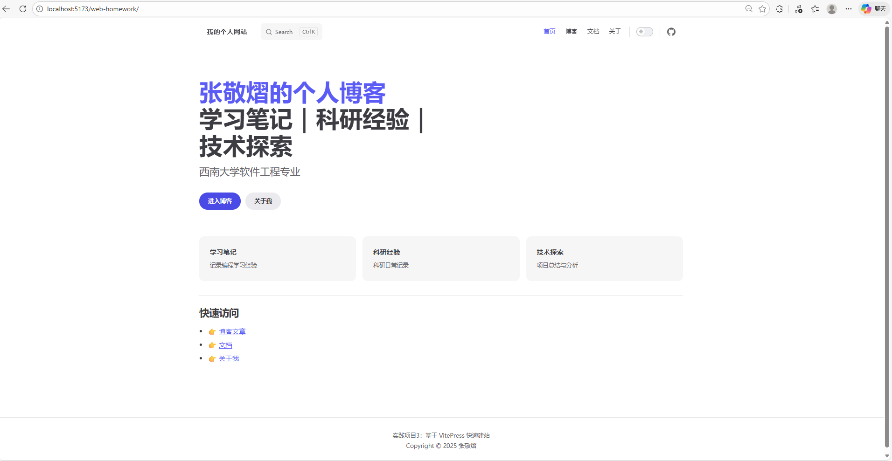
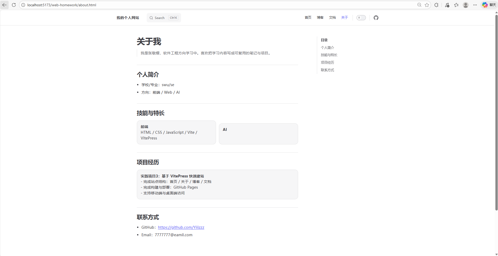
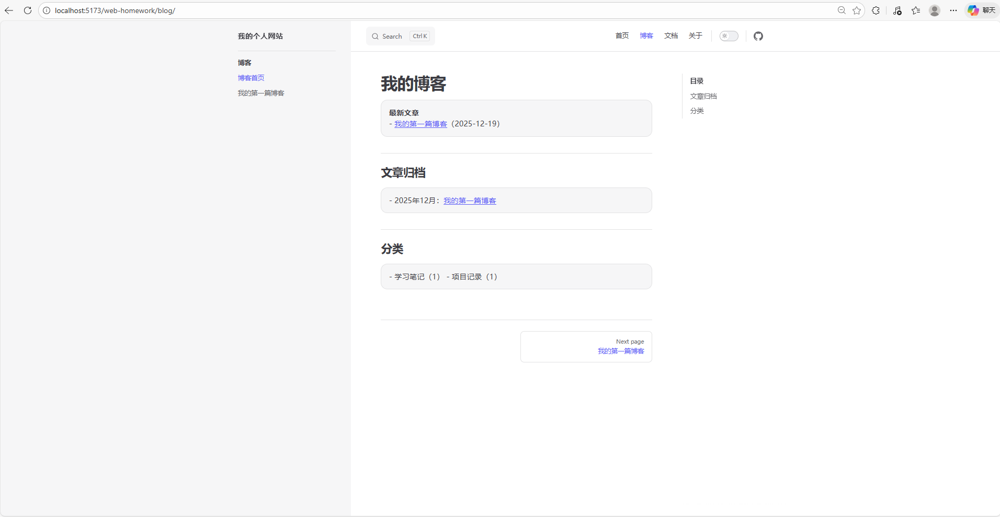

# Vitepress静态站点实验报告模版

## 基本信息
- **姓名**：张敬熠
- **学号**：222023321062101
- **班级**：软件工程中外04班

## 网站访问地址（期末项目考核关键点）

https://yiiizzz.github.io/web-homework/

## 网站源代码仓库链接（期末项目考核关键点）

https://github.com/Yiiizzz/web-homework

## 实验目的

1. 掌握VitePress的基本概念和安装方法
2. 能够使用VitePress创建和配置网站
3. 理解Markdown扩展语法在VitePress中的应用
4. 掌握VitePress主题定制的基本方法
5. 能够使用VitePress部署静态网站
6. 了解静态网站生成器的工作原理和优势
7. 能够根据需求扩展VitePress功能

## 实验环境
- **操作系统**：Windows 10
- **开发工具**：VS Code 
- **浏览器**：Chrome
- **Node.js版本**：v24.12.0
- **VitePress版本**：v1.6.4 
- **网站部署平台**：GitHub Pages

## 实验内容与过程

### 1. VitePress安装与初始化

- 安装VitePress的命令和步骤
- 项目目录结构的创建
- package.json的配置

### 2. 基本配置与内容创建

- 在项目中创建 docs 目录作为站点内容目录，并在其中编写首页、关于我、博客和文档等页面内容。  
  通过 Markdown 编写页面内容，使网站结构清晰、内容简洁。

  主要完成内容包括：

  - 首页（index.md）
  - 关于我页面（about.md）
  - 博客页面（blog）
  - 文档页面（docs/guide）

### 3. 导航栏和侧边栏配置

- 在 VitePress 配置文件中，对网站的导航栏和侧边栏进行了配置。

  - 顶部导航栏包含：首页、关于我、博客、文档  
  - 文档页面配置了侧边栏，实现多级导航结构  
  - 博客页面配置了对应的侧边栏，提升浏览体验  

  通过合理的导航结构，使用户能够快速访问网站各个模块。

### 4. Markdown扩展语法使用

- 在网站内容编写过程中，广泛使用了 Markdown 语法，包括：

  - 标题与段落结构  
  - 无序列表与有序列表  
  - 代码块与语法高亮  
  - 页面内部与外部链接  
  - 图片引用与页面说明  

  Markdown 的使用提高了文档编写效率，也保证了页面的可读性。

### 5. 主题定制

- 在本实验中，对 VitePress 默认主题进行了基础定制：

  - 修改主题主色调  
  - 调整页面整体风格  
  - 优化桌面端与移动端的显示效果  
  - 使用响应式布局，保证不同设备下的良好体验  

  通过主题定制，使网站在保持简洁的同时，具备更好的美观性和可读性。

### 6. 网站构建与部署

- 在完成网站内容和配置后，使用 VitePress 提供的构建命令生成静态文件：npm run docs:build

  构建成功后，将生成的静态文件部署到 GitHub Pages 平台，实现网站的在线访问。  
  通过浏览器访问部署地址，可以正常访问网站的各个页面。

## 实验结果与分析

### 1. 网站效果展示

#### 桌面端效果






#### 移动端效果


### 2. VitePress 技术分析

VitePress 通过配置文件统一管理站点结构与主题样式，使用 Markdown 编写内容，并在构建阶段生成纯静态 HTML 文件。

这种方式具有以下优点：

- 页面加载速度快  
- 部署成本低  
- 维护简单  
- 非常适合文档站点和个人网站

### 3. 网站功能分析

- 本网站实现了以下功能：

  - 清晰的导航栏和侧边栏结构  
  - 良好的响应式设计，支持桌面端和移动端  
  - 页面加载速度快，用户体验良好  
  - 结构清晰，适合后续扩展内容

## 实验总结与体会

### 1. 实验收获

通过本次实验，我系统学习了 VitePress 的使用方法，掌握了静态网站从搭建、配置到部署的完整流程，对现代前端工具链有了更深入的理解。

### 2. 遇到的问题与解决方案

在实验过程中，曾遇到路径配置、构建失败等问题。通过查阅官方文档和不断调试，最终成功解决了这些问题，也提升了独立解决问题的能力。

### 3. 实验反思

在后续学习中，可以进一步优化网站样式，增加更多交互功能，并持续提升网站的整体质量。

## 扩展思考

1. VitePress相比其他静态网站生成器（如Hexo、VuePress）有哪些优势？
2. 静态网站生成器在现代Web开发中的应用场景和优缺点是什么？
3. 如何在VitePress中实现更复杂的功能和交互？
4. 静态网站的部署方式有哪些，各有什么优缺点？
5. 如何平衡网站的美观性、功能性和性能？

## 代码附录

请附上你的主要配置文件代码与关键源码：

### package.json
```json
{
  "name": "vitepress-site",
  "version": "1.0.0",
  "scripts": {
    "docs:dev": "vitepress dev docs",
    "docs:build": "vitepress build docs",
    "docs:preview": "vitepress preview docs"
  },
  "devDependencies": {
    "vitepress": "^1.6.4"
  }
}
```

### config.mts
```typescript
import { defineConfig } from 'vitepress'

export default defineConfig({
  title: '我的个人网站',
  description: '使用 VitePress 搭建的个人网站',
  lang: 'zh-CN',
  base: '/web-homework/',

  themeConfig: {
    nav: [
      { text: '首页', link: '/' },
      { text: '博客', link: '/blog/' },
      { text: '文档', link: '/docs/' },
      { text: '关于', link: '/about' }
    ],

    outline: [2, 3],
    outlineTitle: '目录',

    socialLinks: [
      { icon: 'github', link: 'https://github.com/Yiiizzz' }
    ],
    search: {
      provider: 'local'
    },


    sidebar: {
      '/blog/': [
        {
          text: '博客',
          items: [
            { text: '博客首页', link: '/blog/' },
            { text: '我的第一篇博客', link: '/blog/first-post' }
          ]
        }
      ],
      '/docs/': [
        {
          text: '文档',
          items: [
            { text: '文档首页', link: '/docs/' },
            { text: '快速开始', link: '/docs/guide/getting-started' },
            { text: '配置说明', link: '/docs/guide/configuration' }
          ]
        }
      ]
    },

    footer: {
      message: '实践项目3：基于 VitePress 快速建站',
      copyright: 'Copyright © 2025 张敬熠'
    }
  }
})

```

### index.md
```markdown
---
title: 首页
description: 我的个人网站首页
---

# 欢迎来到我的个人网站

这是一个使用 VitePress 搭建的个人网站。

## 👨‍💻 关于我

我是一名正在学习 Web 开发的学生，通过本项目学习了 VitePress 的使用方法。

## 🛠 技能方向

- HTML / CSS
- JavaScript
- Vue / VitePress
- 前端基础开发
```